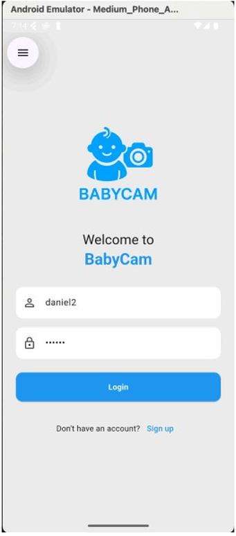
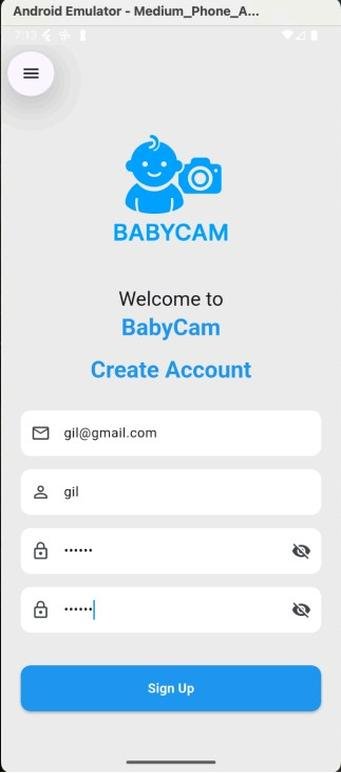
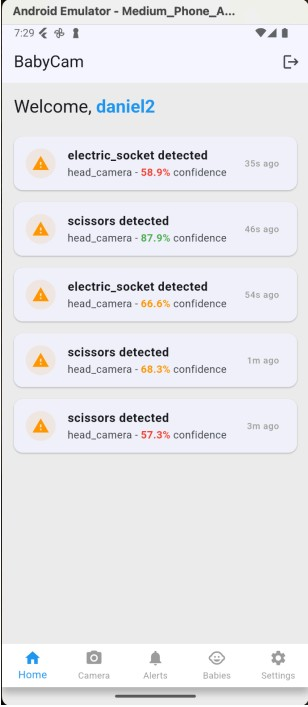
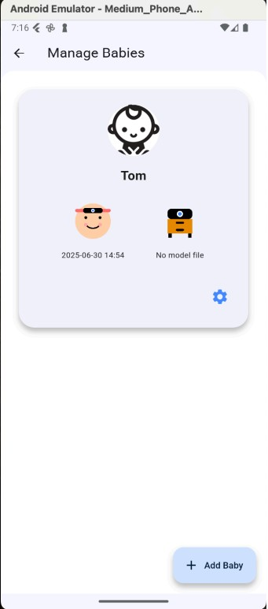
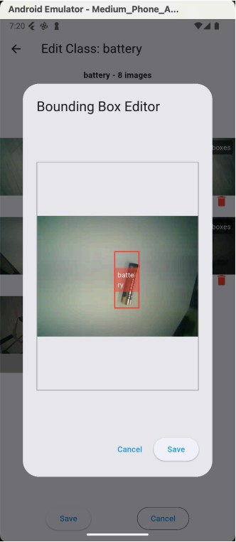
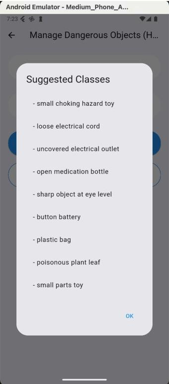
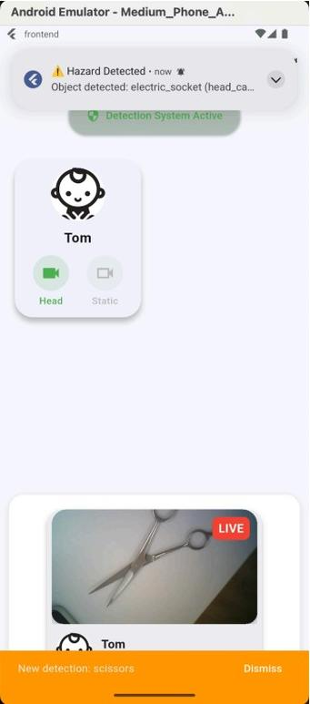
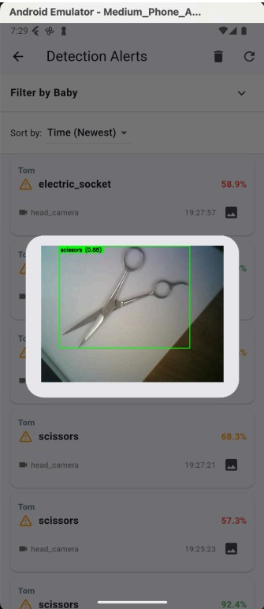
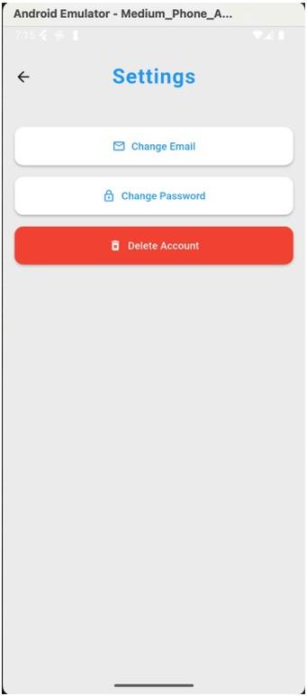

# BabyCam – Infant Safety Monitoring System
## 📌 Overview

BabyCam is an innovative system for monitoring infants near hazardous objects using smart cameras integrated with machine learning. The system sends real-time alerts to parents and enables live monitoring, hazard customization, and cloud-based history tracking.
It is designed to be easy-to-use, privacy-focused, and highly reliable, ensuring the safety and peace of mind of caregivers.

## 🎬 Demo Video

<p align="center">
  <a href="https://www.youtube.com/watch?v=othOOGOn8nY" target="_blank">
    
  </a>
</p>

## 🚀 Features

- Real-time Object Detection – Detects hazardous objects using YOLO-based ML models.

- Multiple Camera Types – Supports both wearable head cameras and static cameras.

- Live Streaming – View real-time camera feeds via mobile app.

- Custom Hazard Management – Add, update, or remove objects to monitor.

- Alert System – Sends push notifications when hazards are detected.

- Cloud Integration – Training data, model files, and alerts stored and managed in the cloud.

- User Profiles – Multiple baby profiles with separate camera and hazard configurations.

- Connection Monitoring – Alerts when a camera disconnects.

## 👀 Screens

    
    

## 🛠 Technologies Used
### Backend:

Language: Python

Framework: FastAPI (REST API + WebSockets)

Database: PostgreSQL (SQLAlchemy ORM)

Cloud: Google Cloud Platform (Cloud Run, Cloud SQL, Google Drive integration)

Machine Learning: YOLOv8 for object detection

ESP32-CAM Streaming: Based on ESP32-CAM-MJPEG-Multiclient

### Frontend:

Framework: Flutter (Android, iOS, Web support)

## 📂 Project Structure
babycam-backend/  
│  
├── app/  
│   ├── controllers/      # Request handling logic  
│   ├── models/           # SQLAlchemy ORM models  
│   ├── routes/           # API route definitions  
│   ├── schemas/          # Pydantic schemas for validation  
│   ├── services/         # Business logic  
│   ├── utils/            # File handling, dataset utils, Drive API  
│   └── db_utils/         # Database query helpers  
│  
├── database/             # DB initialization & migrations  
├── migrations/           # Alembic migration scripts  
├── frontend/              # Flutter app  
└── requirements.txt  

## ⚙️ Installation & Setup
### 1️⃣ Backend:
#### Clone the repository:
```git clone https://github.com/DanielMich99/BabyCam.git
cd BabyCam```

#### Create and activate virtual environment:
```python -m venv venv
source venv/bin/activate  # On Windows: venv\Scripts\activate
```

#### Install dependencies:
```pip install -r requirements.txt```

#### Run database migrations:
```alembic upgrade head```

#### Start FastAPI server:
```uvicorn main:app --reload```

### 2️⃣ Frontend (Flutter):
```cd frontend
flutter pub get
flutter run
```

## 📡 API Endpoints (Examples)

| Method | Endpoint | Description |
| :--- | :--- | :--- |
| **POST** | `/auth/login` | Authenticate a user and return an access token. |
| **POST** | `/baby-profile` | Create a new baby monitoring profile. |
| **POST** | `/model/update` | Trigger an update/re-training of the hazard detection model. |
| **POST** | `/camera/connect` | Initiate the connection process with an ESP32-CAM device. |
| **POST** | `/camera/disconnect` | Close the active connection to a camera. |
| **GET** | `/detection-results/my` | Retrieve the user's history of detected hazards. |

## 🔒 Privacy & Security

All communications secured via HTTPS.

User data encrypted in transit and at rest.

Role-based access control for sensitive operations.

## 📄 More Information

For a detailed project architecture, including abstract, user flows, entity diagrams, and implementation details, please refer to the file:
[architecture.pdf](architecture.pdf)

## 👥 Authors

Gil Matzafi – Frontend & Cloud Integration

Daniel Michaelshvili – Backend, ML Pipeline , System Architecture & IoT

Supervisor: Dr. Ariel Roth
